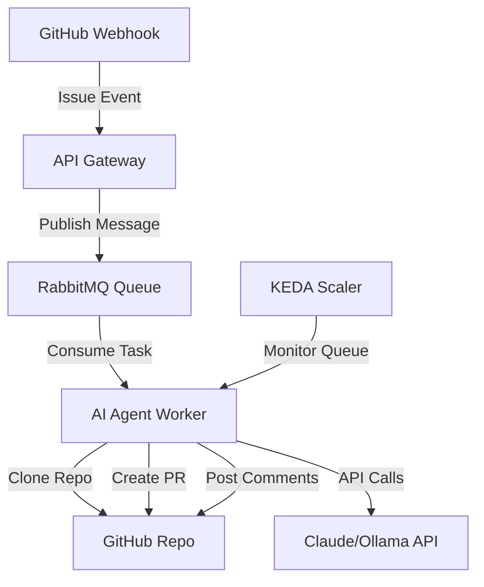

# Plan de Implementación: AI Coding Agent POC

## Objetivo

Construir un Agente de IA Autónomo capaz de resolver issues de GitHub automáticamente, operando en dos modos: **QuickFix** (fire-and-forget) y **Plan Mode** (human-in-the-loop). El sistema será event-driven, escalable a cero, y correrá en Kubernetes.

## Arquitectura General



---

## Iteración 1: Infraestructura Foundation

### Objetivo

Establecer el cluster Kubernetes local con RabbitMQ y KEDA, validando el auto-scaling basado en cola.

### Tareas

1. **Setup Minikube**

   - Inicializar cluster con recursos adecuados (4GB RAM, 2 CPUs mínimo)
   - Habilitar addons necesarios: `metrics-server`, `ingress`
   - Crear namespace `ai-agent`

2. **Deploy RabbitMQ**

   - Instalar usando Helm chart de Bitnami
   - Configurar persistent volume para mensajes
   - Crear queue `agent-tasks` con durabilidad habilitada
   - Exponer Management UI para debugging (puerto 15672)
   - Configurar credenciales en Kubernetes Secret

3. **Deploy KEDA**

   - Instalar KEDA usando Helm
   - Crear `TriggerAuthentication` para RabbitMQ
   - Configurar `ScaledObject` apuntando a un deployment dummy
   - Validar scaling to zero con test manual

4. **Validación**

   - Script de prueba que publique mensajes a RabbitMQ
   - Verificar que KEDA escala pods de 0→1→N según mensajes en cola
   - Confirmar que escala a 0 cuando la cola está vacía

### Archivos a crear

- `k8s/namespace.yaml`
- `k8s/rabbitmq-values.yaml` (configuración Helm)
- `k8s/keda-auth.yaml`
- `k8s/scaledobject.yaml`
- `scripts/test-queue.py` (script de validación)

---

## Iteración 2: Worker "Hello World"

### Objetivo

Crear el worker básico en Python que consuma mensajes de RabbitMQ usando FastStream y demuestre el ciclo completo: consume → procesa → ACK.

### Tareas

1. **Estructura del proyecto Python**

   - Crear directorio `worker/` con estructura modular
   - Setup `pyproject.toml` o `requirements.txt` con dependencias:
     - `faststream[rabbit]`
     - `pydantic` (validación de mensajes)
     - `structlog` (logging estructurado)
   - Configurar `.env` para variables locales

2. **Implementar Worker básico**

   - Crear `worker/main.py` con FastStream app
   - Definir esquema de mensaje con Pydantic: `TaskMessage` (repo_url, issue_id, mode)
   - Implementar handler que:
     - Recibe mensaje
     - Imprime contenido en consola
     - Simula procesamiento (sleep 3s)
     - Retorna ACK automático
   - Manejar excepciones con NACK para re-queueing

3. **Dockerizar Worker**

   - Crear `Dockerfile` multi-stage:
     - Build stage: instalar dependencias
     - Runtime stage: imagen slim con código
   - Build y push a registry local de Minikube
   - Crear `k8s/deployment.yaml` para el worker
   - Configurar `emptyDir` volume para futuras operaciones git

4. **Integración con KEDA**

   - Actualizar `ScaledObject` para apuntar al deployment real
   - Configurar variables de entorno desde ConfigMap/Secret
   - Testing end-to-end: publicar mensaje → ver pod spawn → ver logs → ver pod terminar

### Archivos a crear

- `worker/main.py`
- `worker/models.py` (Pydantic schemas)
- `worker/config.py` (configuración desde env)
- `Dockerfile`
- `requirements.txt`
- `k8s/deployment.yaml`
- `k8s/configmap.yaml`

---

## Iteración 3: Integración Git & LLM

### Objetivo

Extender el worker para clonar repositorios, leer código fuente, interactuar con LLM (Ollama inicialmente) e implementar **Plan Mode**.

### Tareas

1. **Módulo Git Operations**

   - Crear `worker/git_handler.py`:
     - Función `shallow_clone(repo_url, target_dir)` usando `git clone --depth 1`
     - Función `create_branch(branch_name)` desde main
     - Función `cleanup(target_dir)` para borrar workspace temporal
   - Manejar autenticación con token de GitHub (desde Secret)
   - Testing unitario con repo público

2. **Context Retrieval (RAG simplificado)**

   - Crear `worker/context_builder.py`:
     - Leer issue description desde GitHub API
     - Generar file tree del repositorio
     - Identificar archivos candidatos relevantes (por extensión, keywords en issue)
     - Leer contenido de top-5 archivos más relevantes
     - Construir prompt con: issue + file tree + contenido archivos

3. **Integración con LLM (Ollama)**

   - Crear `worker/llm_client.py`:
     - Cliente HTTP para Ollama API (modelo `codellama` o `deepseek-coder`)
     - Función `generate_plan(context)` que retorna markdown con estrategia
     - Configurar timeout y retry logic
   - Deploy Ollama en Kubernetes o usar instancia externa

4. **Implementar Plan Mode**

   - Crear `worker/modes/plan_mode.py`:
     - Orquestar: clone → build context → call LLM → post comment
     - Usar GitHub API (`PyGithub` library) para:
       - Crear branch
       - Crear PR draft
       - Postear plan como comentario en PR
     - Guardar estado en labels del issue ("plan-pending")

5. **Testing end-to-end**

   - Crear repo de prueba con issue simple
   - Publicar mensaje en RabbitMQ simulando webhook
   - Validar que el worker:
     - Clone el repo correctamente
     - Genere un plan coherente
     - Cree PR draft con comentario

### Archivos a crear/modificar

- `worker/git_handler.py`
- `worker/context_builder.py`
- `worker/llm_client.py`
- `worker/modes/plan_mode.py`
- `worker/modes/__init__.py`
- `worker/github_client.py` (wrapper para PyGithub)
- Actualizar `requirements.txt`: `GitPython`, `PyGithub`, `httpx`
- `k8s/secrets.yaml` (GitHub token, Ollama endpoint)

---

## Iteración 4: Ejecución & PRs (QuickFix Mode)

### Objetivo

Implementar la capacidad de aplicar código generado por el LLM, hacer commits y push, completando el **QuickFix Mode**.

### Tareas

1. **LLM Code Generation**

   - Extender `worker/llm_client.py`:
     - Función `generate_code(context, plan)` que retorna diffs o código completo
     - Parsear respuesta del LLM para extraer cambios (formato XML o JSON)
     - Validar que solo modifique archivos que estaban en el contexto

2. **Code Application**

   - Crear `worker/code_applier.py`:
     - Aplicar diffs/patches a archivos locales
     - Ejecutar syntax checker (AST parse para Python, eslint para JS, etc.)
     - Si falla → re-prompt al LLM con error (max 1 retry)
     - Si pasa → preparar commit

3. **Git Operations avanzadas**

   - Extender `worker/git_handler.py`:
     - `commit_changes(message)` con mensaje descriptivo
     - `push_branch(branch_name)` con autenticación
     - Manejar conflictos y errores de push

4. **Implementar QuickFix Mode**

   - Crear `worker/modes/quickfix_mode.py`:
     - Orquestar: clone → context → generate code → apply → syntax check → commit → push
     - Crear PR lista para review (no draft)
     - Añadir labels automáticos: `ai-generated`, `quickfix`
     - Postear comentario con resumen de cambios

5. **Plan Mode Phase 2 (Approval)**

   - Crear `worker/modes/plan_approval.py`:
     - Detectar comando `/approve` en comentarios de PR
     - Cambiar PR de draft a ready
     - Ejecutar mismo flujo que QuickFix
     - Actualizar descripción del PR con detalles de implementación

6. **Orquestador de modos**

   - Actualizar `worker/main.py`:
     - Router que detecte modo desde mensaje
     - Dispatcher a `plan_mode`, `quickfix_mode`, o `plan_approval`

### Archivos a crear/modificar

- `worker/llm_client.py` (extender)
- `worker/code_applier.py`
- `worker/syntax_checker.py`
- `worker/modes/quickfix_mode.py`
- `worker/modes/plan_approval.py`
- Actualizar `worker/main.py` con router
- `k8s/deployment.yaml` (añadir herramientas de syntax: node, python)

---

## Iteración 5: Webhooks de GitHub

### Objetivo

Crear API Gateway que reciba webhooks de GitHub y publique tareas en RabbitMQ, cerrando el loop de automatización.

### Tareas

1. **API Gateway con FastAPI**

   - Crear directorio `api-gateway/`
   - Implementar `api-gateway/main.py`:
     - Endpoint POST `/webhook/github`
     - Validar firma HMAC del webhook (GitHub secret)
     - Parsear payload de eventos: `issues.assigned`, `issue_comment.created`
   - Filtrado inteligente:
     - Solo procesar issues con label `ai-help`
     - Detectar `/approve` en comentarios para Plan Mode

2. **Publicador a RabbitMQ**

   - Crear `api-gateway/queue_publisher.py`:
     - Cliente AMQP para publicar mensajes
     - Normalizar payload: extraer repo_url, issue_id, mode
     - Añadir metadata: timestamp, trigger_user

3. **Deployment del Gateway**

   - Crear `api-gateway/Dockerfile`
   - Crear `k8s/api-gateway-deployment.yaml`
   - Crear `k8s/api-gateway-service.yaml` (tipo LoadBalancer o Ingress)
   - Exponer endpoint público (usar ngrok para testing local)

4. **Configurar GitHub Webhook**

   - Crear GitHub App o configurar webhook manual
   - Permisos necesarios: `issues: read/write`, `pull_requests: write`, `contents: write`
   - URL del webhook → Minikube IP + Ingress path
   - Secret para validación HMAC

5. **Testing end-to-end**

   - Crear issue en repo de prueba con label `ai-help`
   - Asignar issue al bot user
   - Verificar que el webhook dispare toda la cadena:
     - API Gateway recibe evento
     - Mensaje publicado en RabbitMQ
     - Worker consume y procesa
     - PR creado en GitHub

### Archivos a crear

- `api-gateway/main.py`
- `api-gateway/webhook_handler.py`
- `api-gateway/queue_publisher.py`
- `api-gateway/security.py` (validación HMAC)
- `api-gateway/requirements.txt`: `fastapi`, `uvicorn`, `pika`, `pydantic`
- `api-gateway/Dockerfile`
- `k8s/api-gateway-deployment.yaml`
- `k8s/api-gateway-service.yaml`
- `k8s/ingress.yaml`

---

## Iteración 6: Kubernetes Resources & Production Readiness

### Objetivo

Consolidar todos los recursos Kubernetes, implementar gestión de secrets segura, y preparar el proyecto para deployment productivo.

### Tareas

1. **Gestión centralizada de Secrets**

   - Crear `k8s/secrets/` con templates
   - Secrets necesarios:
     - `github-token`: Token de GitHub App
     - `rabbitmq-credentials`: User/password
     - `llm-api-key`: Claude API key (para migración futura)
     - `webhook-secret`: HMAC secret de GitHub
   - Documentar proceso de creación: `kubectl create secret generic ...`
   - Opcional: integrar con Sealed Secrets o External Secrets Operator

2. **Resource Limits & Requests**

   - Actualizar todos los Deployments con:
     - `resources.requests`: CPU/memoria mínima
     - `resources.limits`: CPU/memoria máxima
     - Valores recomendados:
       - Worker: 500m CPU, 1Gi RAM (request), 2 CPU, 4Gi RAM (limit)
       - API Gateway: 200m CPU, 256Mi RAM (request), 1 CPU, 512Mi RAM (limit)

3. **Health Checks & Readiness Probes**

   - Añadir endpoints en worker y gateway:
     - `/health` (liveness): chequeo básico
     - `/ready` (readiness): verifica conexión a RabbitMQ
   - Configurar en Deployments:
     - `livenessProbe`: restart si falla
     - `readinessProbe`: no enviar tráfico si no está listo

4. **Logging & Monitoring**

   - Configurar structured logging (JSON) en worker y gateway
   - Añadir labels estándar a todos los recursos:
     - `app.kubernetes.io/name`
     - `app.kubernetes.io/component`
     - `app.kubernetes.io/version`
   - Documentar integración opcional con Prometheus/Grafana

5. **Kustomize o Helm Chart**

   - Organizar recursos en estructura Kustomize:
     - `k8s/base/`: recursos comunes
     - `k8s/overlays/dev/`: configuración local
     - `k8s/overlays/prod/`: configuración producción
   - Crear `kustomization.yaml` para cada capa
   - Parametrizar valores críticos (replicas, images, endpoints)

6. **Documentación operativa**

   - Crear `docs/DEPLOYMENT.md`:
     - Paso a paso para deploy en Minikube
     - Paso a paso para deploy en cluster remoto
     - Troubleshooting común
   - Crear `docs/OPERATIONS.md`:
     - Cómo ver logs de workers
     - Cómo escalar manualmente
     - Cómo pausar procesamiento
   - Actualizar [README.md](README.md) con sección "Getting Started"

7. **CI/CD Básico**

   - Crear `.github/workflows/build.yaml`:
     - Build de imágenes Docker en cada push
     - Tag con versión semántica
     - Push a Docker Hub o GitHub Container Registry
   - Crear `.github/workflows/test.yaml`:
     - Linting (ruff para Python)
     - Tests unitarios (pytest)
     - Validación de YAMLs Kubernetes (kubeval)

8. **Migración a Claude API**

   - Actualizar `worker/llm_client.py`:
     - Añadir provider factory: `get_llm_provider(type="ollama"|"claude")`
     - Implementar cliente Claude con Anthropic SDK
     - Mantener retrocompatibilidad con Ollama
   - Configurar via ConfigMap qué provider usar

### Archivos a crear/modificar

- `k8s/secrets/github-token.yaml.template`
- `k8s/secrets/rabbitmq-credentials.yaml.template`
- `k8s/base/kustomization.yaml`
- `k8s/overlays/dev/kustomization.yaml`
- `docs/DEPLOYMENT.md`
- `docs/OPERATIONS.md`
- Actualizar [README.md](README.md)
- `.github/workflows/build.yaml`
- `.github/workflows/test.yaml`
- `worker/health.py` (health check endpoints)
- `api-gateway/health.py`
- Actualizar todos los Deployments con probes y resources

---

## Estructura Final del Proyecto

```
ai-coding-agent/
├── api-gateway/
│   ├── main.py
│   ├── webhook_handler.py
│   ├── queue_publisher.py
│   ├── security.py
│   ├── health.py
│   ├── requirements.txt
│   └── Dockerfile
├── worker/
│   ├── main.py
│   ├── config.py
│   ├── models.py
│   ├── git_handler.py
│   ├── context_builder.py
│   ├── llm_client.py
│   ├── code_applier.py
│   ├── syntax_checker.py
│   ├── github_client.py
│   ├── health.py
│   ├── modes/
│   │   ├── __init__.py
│   │   ├── plan_mode.py
│   │   ├── quickfix_mode.py
│   │   └── plan_approval.py
│   ├── requirements.txt
│   └── Dockerfile
├── k8s/
│   ├── base/
│   │   ├── namespace.yaml
│   │   ├── rabbitmq-values.yaml
│   │   ├── keda-auth.yaml
│   │   ├── scaledobject.yaml
│   │   ├── deployment.yaml
│   │   ├── api-gateway-deployment.yaml
│   │   ├── api-gateway-service.yaml
│   │   ├── ingress.yaml
│   │   ├── configmap.yaml
│   │   └── kustomization.yaml
│   ├── overlays/
│   │   ├── dev/kustomization.yaml
│   │   └── prod/kustomization.yaml
│   └── secrets/
│       ├── github-token.yaml.template
│       ├── rabbitmq-credentials.yaml.template
│       └── webhook-secret.yaml.template
├── scripts/
│   └── test-queue.py
├── docs/
│   ├── DEPLOYMENT.md
│   └── OPERATIONS.md
├── .github/
│   └── workflows/
│       ├── build.yaml
│       └── test.yaml
├── tests/
│   ├── test_worker.py
│   └── test_api_gateway.py
├── .gitignore
├── README.md
└── LICENSE
```

---

## Stack Tecnológico Final

| Componente | Tecnología |

|------------|------------|

| Orquestación | Kubernetes (Minikube local) + KEDA |

| Message Broker | RabbitMQ |

| Queue Client | FastStream |

| Worker Runtime | Python 3.11+ |

| API Gateway | FastAPI + Uvicorn |

| LLM (dev) | Ollama (codellama/deepseek-coder) |

| LLM (prod) | Claude 3.5 Sonnet (Anthropic API) |

| Git Operations | GitPython |

| GitHub API | PyGithub |

| Logging | structlog |

| Testing | pytest |

| CI/CD | GitHub Actions |

| Secrets | Kubernetes Secrets |

---

## Criterios de Éxito

Al finalizar las 6 iteraciones, el sistema debe ser capaz de:

1. ✅ Recibir webhooks de GitHub cuando se asigna un issue con label `ai-help`
2. ✅ Escalar automáticamente workers de 0 a N según carga
3. ✅ Clonar repositorios y analizar código relevante
4. ✅ Generar planes de solución coherentes (Plan Mode)
5. ✅ Esperar aprobación humana vía comando `/approve`
6. ✅ Generar código sintácticamente válido
7. ✅ Crear PRs automáticamente con cambios aplicados
8. ✅ Manejar fallos gracefully (re-queue en caso de error)
9. ✅ Escalar a cero cuando no hay tareas pendientes
10. ✅ Ser deployable en cualquier cluster Kubernetes estándar

---

## Próximos Pasos (Post-POC)

- Implementar RAG real con embeddings (ChromaDB/Pinecone) para mejor selección de archivos
- Añadir soporte para Jira
- Crear Helm Chart reutilizable
- Implementar feedback loop: analizar PRs aceptados/rechazados para mejorar prompts
- Añadir telemetría con OpenTelemetry
- Implementar rate limiting para LLM API calls
- Crear dashboard de métricas (issues resueltos, tasa de éxito, costos LLM)