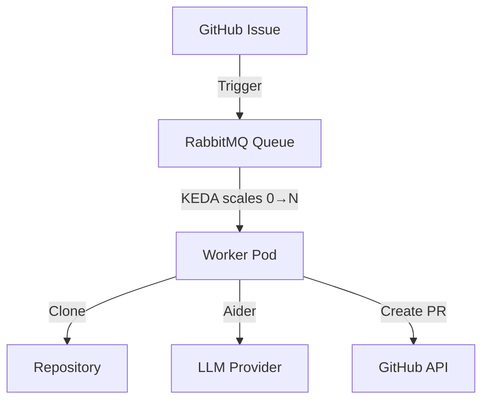

# AI Coding Agent

An autonomous AI agent that resolves GitHub issues by analyzing code, generating fixes, and creating pull requests automatically.

## Overview

The AI Coding Agent is an event-driven system built on Kubernetes that processes GitHub issues. It uses [Aider](https://aider.chat) as the code generation engine, which supports any LLM provider (OpenAI, Anthropic, local models via Ollama, etc.).

For optimal results, a sufficiently powerful LLM is recommended (e.g., Claude 3.5 Sonnet, GPT-4o, DeepSeek Coder V2). Ollama with local models is supported for development and testing environments.

For deployment instructions, see [docs/DEPLOYMENT.md](docs/DEPLOYMENT.md). For architecture details, see [docs/ARCHITECTURE.md](docs/ARCHITECTURE.md).

## Modes

### QuickFix Mode

Automatically generates code and creates a PR for the issue.

**Workflow:**
1. Agent receives the issue via RabbitMQ.
2. Clones the repository.
3. Uses Aider + LLM to generate the code fix.
4. Commits, pushes, and opens a Pull Request.
5. Posts a comment on the issue linking to the PR.

### Refine Mode *(In Progress)*

Allows reviewers to request changes on an agent-created PR using a `/refine` command.

**Workflow:**
1. A reviewer comments `/refine <description of changes>` on the PR.
2. The agent picks up the refinement request.
3. Aider applies the requested changes to the existing branch.
4. Pushes the updated code to the same PR.

## Architecture

The architecture is **stateless** and **event-driven**.



### Design Principles

1. **Stateless Workers** — Pods do not retain state between jobs.
2. **Scale to Zero** — KEDA scales the worker pool to zero when the queue is empty.
3. **Robust Delivery** — RabbitMQ ACK/NACK ensures no tasks are lost if a pod crashes.
4. **Ephemeral Storage** — Workers use `emptyDir` for temporary git operations.

## Technology Stack

| Component | Choice | Justification |
|---|---|---|
| **Language** | Python 3.11+ | AI ecosystem (FastStream, Pydantic, Aider) |
| **Message Broker** | RabbitMQ | Delivery guarantees (ACK/NACK), persistence |
| **Queue Library** | FastStream | Async AMQP abstraction, portable across brokers |
| **Orchestration** | Kubernetes + KEDA | Auto-scaling based on queue depth |
| **Code Generation** | Aider | AI pair programming tool, edits files directly |
| **LLM** | Any (OpenAI, Anthropic, Ollama, etc.) | Aider supports multiple providers. Use powerful models for best results |
| **Git** | GitPython + subprocess | Repository cloning, branching, pushing |
| **GitHub API** | PyGithub | Issue/PR management |

## Project Structure

```
ai-coding-agent/
├── pyproject.toml              # Python package definition
├── Dockerfile                  # Container image
├── Makefile                    # Build automation
├── install.sh                  # K8s automated deployment
├── docs/
│   └── DEPLOYMENT.md           # Deployment & dev guide
├── k8s/                        # Kubernetes manifests
│   ├── base/
│   └── secrets/
├── scripts/                    # Utility scripts
│   ├── setup-local.sh
│   ├── cleanup-local.sh
│   └── test-iteration3.py
└── src/worker/                 # Application code
    ├── main.py                 # FastStream entrypoint & routing
    ├── config.py               # Configuration (env vars)
    ├── models.py               # Pydantic message models
    ├── llm_client.py           # Aider + Ollama integration
    ├── git/
    │   ├── git_client.py       # Git provider factory
    │   ├── git_handler.py      # Git operations (clone, branch, push)
    │   └── github_client.py    # GitHub API client
    └── modes/
        └── quickfix_mode.py    # QuickFix workflow orchestrator
```

## Worker Execution Flow

1. **Consume** — Worker claims a message from RabbitMQ.
2. **Clone** — Shallow clone (`depth=1`) of the target repository.
3. **Fetch Issue** — Read issue details from GitHub API.
4. **Generate Code** — Aider analyzes the repo and generates changes using the configured LLM.
5. **Push** — Commit and push changes to a new branch.
6. **Create PR** — Open a pull request with the fix.
7. **Comment** — Post a comment on the issue linking to the PR.
8. **Cleanup** — Delete temporary workspace.
9. **ACK** — Acknowledge message to RabbitMQ.

## Security

- **Secrets** are injected via Kubernetes Secrets (GitHub token, RabbitMQ credentials).
- **Token Scope** is limited to `repo` (contents + issues + PRs).
- **Ephemeral workspaces** are deleted after each task.
- **Human review** is always required before merging agent-generated PRs.

For details on hallucination control, access control, and threat model, see [docs/SECURITY.md](docs/SECURITY.md).

## LLM Configuration

The agent supports any LLM provider through Aider: OpenAI, Anthropic, Ollama, and more. See [docs/LLM_CONFIGURATION.md](docs/LLM_CONFIGURATION.md) for setup instructions and recommended models.

## Roadmap

- [x] Kubernetes infrastructure (RabbitMQ, KEDA, auto-scaling)
- [x] Worker with FastStream message consumer
- [x] Git operations (clone, branch, commit, push)
- [x] GitHub API integration (issues, PRs, comments)
- [x] LLM integration via Aider + Ollama
- [x] QuickFix Mode (end-to-end)
- [ ] Refine Mode (`/refine` command on PRs)
- [ ] GitHub webhook integration (automatic issue detection)
- [ ] CI/CD pipeline
- [ ] Helm chart

## License

See [LICENSE](LICENSE) for details.
