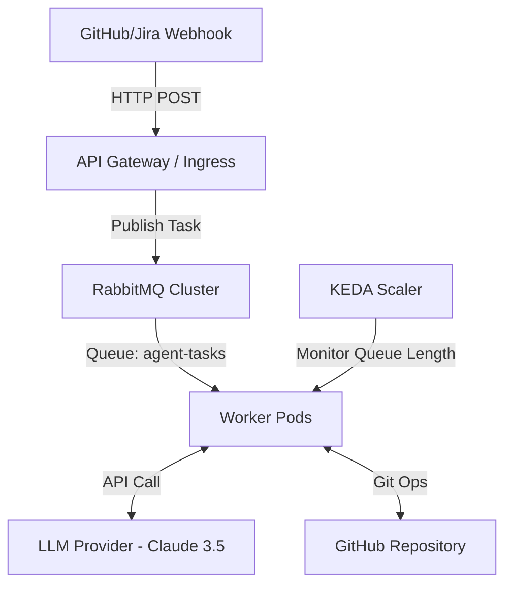

# ai-coding-agent

# AI Coding Agent - Proof of Concept (POC) Technical Design Document

> **Status**: 🚧 Iterations 1 & 2 Implemented - Infrastructure and Hello World Worker  
> **Quick Start**: See [QUICKSTART.md](QUICKSTART.md) for deployment instructions  

## Getting Started

This project is being built iteratively. Currently implemented:

- ✅ **Iteration 1**: Kubernetes infrastructure with RabbitMQ and KEDA auto-scaling
- ✅ **Iteration 2**: Hello World worker with FastStream
- ⏳ **Iteration 3**: Git & LLM Integration (Next)
- ⏳ **Iteration 4**: Code Execution & PRs
- ⏳ **Iteration 5**: GitHub Webhooks
- ⏳ **Iteration 6**: Production Hardening

**To deploy locally:** Follow the [QUICKSTART.md](QUICKSTART.md) guide or use `make all` to deploy everything automatically.

## 1. Executive Summary
The objective of this project is to build an **Autonomous AI Coding Agent** capable of resolving low-to-medium complexity GitHub/Jira issues. The tool aims to reduce cognitive load and repetitive work for developers by operating asynchronously.

The system utilizes an **Event-Driven Architecture** on Kubernetes, leveraging **RabbitMQ** for robust message queuing and **KEDA** for serverless-like auto-scaling (scaling to zero).


## 2. Core Features & Modes

The agent operates in two distinct configurations, depending of the label you set in the issue:

### A. QuickFix Mode ("Fire and Forget")
* **Use Case:** Atomic tasks such as simple bugs, typos, documentation updates, or dependency bumps.
* **Workflow:**
    1.  Agent receives the issue context.
    2.  Agent analyzes code and generates the solution.
    3.  Agent immediately opens a Pull Request (PR) with the fix.

### B. Plan Mode ("Human-in-the-loop")
* **Use Case:** Small features, refactoring, or complex bugs requiring supervision.
* **Phase 1 - Proposal:**
    1.  Agent analyzes the repository and the issue.
    2.  Agent opens a Pull Request.
    2.  Agent posts a **comment** on the issue detailing a plan (files to modify, strategy).
    3.  Agent waits for human feedback.
* **Phase 2 - Execution:**
    1.  Maintainer triggers approval (e.g., comment `/approve`).
    2.  Agent update the PR description and write the description of the solution (follow PR guidelines).
    2.  Agent executes the approved plan, generates code, and pushes the PR.

In order the issue been done by the agent, it should be assigned by the agent user, which will be a user in Jira/GitHub that trigger an action/webhook to send all issue information to the agent API.

#### DISCUSSION: Verify if can create dummy users on Jira/GitHub to trigger the webhook process. If not, maybe can do the same using specific labels.

## 3. System Architecture

The architecture is designed to be **Stateless** and **Event-Driven**.

### 3.1 High-Level Diagram



### 3.2 Design Principles

1. **Stateless Workers:** Pods do not retain state between jobs. "State is stored in the Issue, not in the Pod."
2. **Robustness (Ack/Nack):** Utilizing RabbitMQ ensures no tasks are lost if a pod crashes during execution (automatic re-queueing).
3. **Cost-Efficiency:** KEDA allows the worker pool to scale to zero when the queue is empty.
4. **Ephemeral Storage:** Workers use `emptyDir` for temporary git operations, cleaning up immediately after task completion.


## 4. Technology Stack

| Component | Choice | Justification |
| --- | --- | --- |
| **Language** | **Python 3.11+** | Dominant ecosystem for AI (LangChain, LlamaIndex, FastStream). |
| **Message Broker** | **RabbitMQ** | Chosen over Redis for robust delivery guarantees (Ack/Nack) and native persistence. |
| **Queue Library** | **FastStream** | Modern abstraction layer over AMQP, allowing future switch to Kafka/Redis if needed without code rewrites. |
| **Orchestration** | **Kubernetes + KEDA** | Native auto-scaling based on RabbitMQ queue depth. |
| **LLM Model** | **Claude 3.5 Sonnet** | Current SOTA (State of the Art) model for code generation. |
| **Git Strategy** | **Shallow Clone** | `git clone --depth 1` to minimize bandwidth and storage usage. |


## 5. Detailed Workflows

### 5.1 Task Ingestion

1. **Webhook:** Payload received from GitHub/Jira.
2. **Filtering:** Verify relevance (e.g., label `ai-help` present).
3. **Publishing:** Payload is normalized and sent to RabbitMQ queue `agent-tasks`.
* *Payload structure:* `{ "repo_url": "...", "issue_id": 123, "mode": "plan", "trigger_user": "dev1" }`


### 5.2 Worker Execution Cycle

The worker is a Python script managed by KEDA.

1. **Consume:** Worker claims a message from RabbitMQ.
2. **Environment Setup:**
* Create temporary directory.
* Perform `git clone --depth 1` (Snapshot of current code).


3. **Context Retrieval (RAG):**
* Read issue description.
* Identify relevant files via file-tree analysis.
* Read content of candidate files.


4. **LLM Reasoning:**
* Send Context + Issue + Instructions to Claude API.
* Receive Logic or Code diff.


5. **Action:**
* *Both:* Create the PR
* *If Plan Mode:* Post comment via GitHub API in the PR.
* *If QuickFix/Approved:* Apply patches locally -> `git commit` -> `git push` -> Request a aprove/revision.


6. **Cleanup:** Recursively delete temporary directory.
7. **Acknowledge:** Send `ACK` to RabbitMQ.


## 6. Infrastructure & DevOps Configuration

### 6.1 RabbitMQ Deployment (Helm)

Standard deployment using Bitnami chart.

```bash
helm install rabbitmq oci://registry-1.docker.io/bitnami/rabbitmq

```

### 6.2 KEDA ScaledObject

Configuration to autoscale workers based on pending tasks.

```yaml
apiVersion: keda.sh/v1alpha1
kind: ScaledObject
metadata:
  name: agent-worker-scaler
  namespace: default
spec:
  scaleTargetRef:
    name: ai-agent-worker
  minReplicaCount: 0       # Scale to zero enabled
  maxReplicaCount: 10      # Circuit breaker for costs
  triggers:
  - type: rabbitmq
    metadata:
      queueName: agent-tasks
      mode: QueueLength
      value: "1"           # Target 1 pod per 1 message
    authenticationRef:
      name: keda-rabbitmq-auth

```


## 7. Security & Risk Management

### 7.1 Hallucination Control

* **Strict Context Window:** The agent is explicitly instructed to only modify files it has read.
* **Syntax Check:** Before pushing, the worker runs a basic syntax check (AST parse). If it fails, the agent is prompted to self-correct (Max 1 retry).

### 7.2 Access Control

* **Secrets Management:** API Keys (Claude, GitHub Token) are injected via Kubernetes Secrets.
* **Token Scope:** The GitHub App token is scoped strictly to `contents: write` and `issues: write` for specific repositories.


## 8. POC Roadmap

1. **Iteration 1: Infrastructure Foundation**
* Set up local K8s cluster (Minikube/Kind).
* Deploy RabbitMQ and verify KEDA scaling.


2. **Iteration 2: The "Hello World" Worker**
* Create Python worker with FastStream.
* Implement loop: Receive message -> Print to console -> ACK.


3. **Iteration 3: Git & LLM Integration**
* Implement `git clone --depth 1`.
* Connect to LLMs using Ollama
* Implement "Plan Mode" (just posting proposal).


4. **Iteration 4: Execution & PRs**
* Implement code application logic.
* Implement "QuickFix"


5. **Iteration 5: Add webhook**
* Add GitHub webhook to send issue data 
* End-to-end testing with a dummy repository.


6. **Iteration 6: Add all Kubernetes resources to deploy the agent**
* Add K8s resources
* All credentials should be set as secrets

#### DISCUSSION: Maybe other iteration to convert the project into a Kubernetes operator or a Helm chart?

