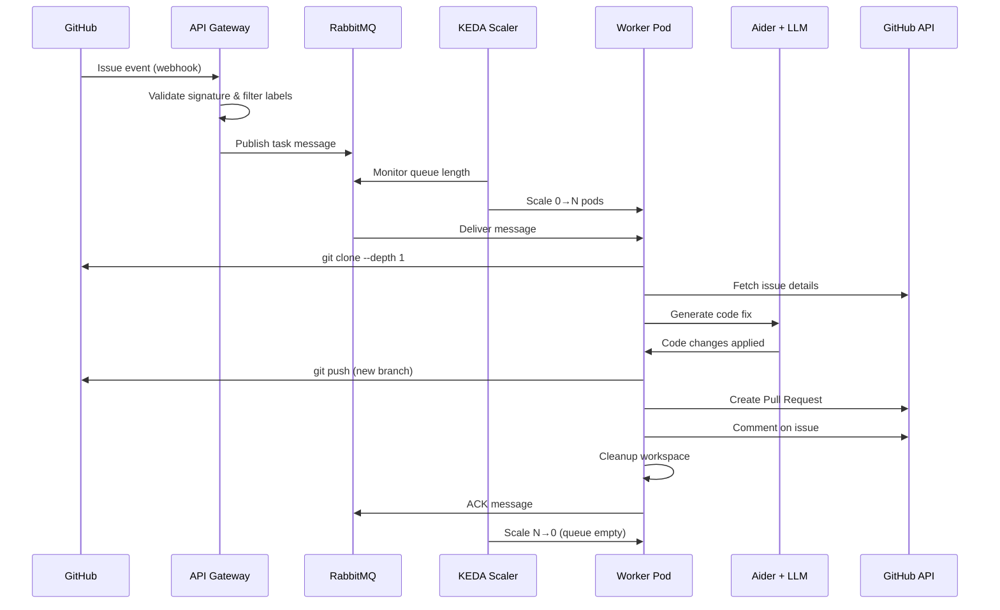

# Architecture

## Overview

The AI Coding Agent follows an **event-driven, stateless** architecture. Tasks are published to a message queue and consumed by ephemeral worker pods that scale automatically based on demand.

## High-Level Flow



## Task Ingestion

Tasks enter the system through a message published to RabbitMQ. In the future, a webhook gateway will handle this automatically. Currently, tasks are published manually via a test script.

### Ingestion Flow

1. **Event Source** — A GitHub issue is created or labeled with `ai-help`.
2. **Filtering** — Only issues matching specific criteria are processed (correct label, not already processed).
3. **Normalization** — The event payload is normalized into a standard task message.
4. **Publishing** — The normalized message is published to the `agent-tasks` RabbitMQ queue.

### Message Payload

```json
{
  "repo_url": "https://github.com/owner/repo",
  "issue_id": 42,
  "mode": "quickfix",
  "trigger_user": "username"
}
```

| Field | Type | Description |
|---|---|---|
| `repo_url` | string (URL) | Full GitHub repository URL |
| `issue_id` | integer | GitHub issue number |
| `mode` | string | Execution mode: `quickfix` or `refine` |
| `trigger_user` | string | User who triggered the task |

## Worker Execution

Each worker pod processes exactly one task before being eligible for scale-down.

### Execution Steps

1. **Consume** — FastStream subscriber claims a message from the durable `agent-tasks` queue.
2. **Clone** — Shallow clone (`git clone --depth 1`) of the target repository into an ephemeral `emptyDir` volume.
3. **Fetch Issue** — GitHub API call to retrieve issue title, body, labels, and metadata.
4. **Code Generation** — Aider is invoked as a subprocess with the issue description as prompt. Aider has full access to the cloned repository and uses the configured LLM to generate changes.
5. **Branch & Push** — A new branch (`ai-agent/quickfix-issue-{id}`) is created, changes are committed, and pushed to the remote.
6. **Create PR** — A pull request is opened via the GitHub API with a description of the changes.
7. **Comment** — A comment is posted on the original issue linking to the PR.
8. **Cleanup** — The cloned repository is deleted from the temporary workspace.
9. **ACK** — The message is acknowledged to RabbitMQ, removing it from the queue.

If any step fails, the message is NACKed and requeued for retry.

## Infrastructure

### RabbitMQ

Deployed as a simple Kubernetes Deployment with the official `rabbitmq:3-management` image.

- Queue: `agent-tasks` (durable)
- Management UI available on port 15672
- Credentials managed via Kubernetes Secrets

### KEDA ScaledObject

KEDA monitors the RabbitMQ queue and scales the worker deployment accordingly.

```yaml
apiVersion: keda.sh/v1alpha1
kind: ScaledObject
metadata:
  name: ai-agent-worker-scaler
  namespace: ai-agent
spec:
  scaleTargetRef:
    name: ai-agent-worker
  minReplicaCount: 0        # Scale to zero when idle
  maxReplicaCount: 10       # Cost circuit breaker
  pollingInterval: 10       # Check queue every 10 seconds
  cooldownPeriod: 30        # Wait 30s before scaling down
  triggers:
  - type: rabbitmq
    metadata:
      queueName: agent-tasks
      mode: QueueLength
      value: "1"            # One pod per message
    authenticationRef:
      name: keda-rabbitmq-auth
```

### Worker Deployment

Workers are deployed as a standard Kubernetes Deployment with `replicas: 0` (managed by KEDA).

Key configuration:
- `imagePullPolicy: Never` — Uses locally loaded images in Minikube
- `terminationGracePeriodSeconds: 1800` — 30 minutes to allow long-running LLM tasks to complete
- `emptyDir` volume for temporary git workspace (5Gi limit)
- Environment variables injected from ConfigMap and Secrets

## Scaling Behavior

| Queue State | Worker Pods | Action |
|---|---|---|
| Empty | 0 | KEDA keeps deployment at zero |
| 1 message | 1 | KEDA scales to 1 pod |
| N messages | N (max 10) | One pod per message |
| Queue drains | 0 (after 30s) | Cooldown period before scale-down |

