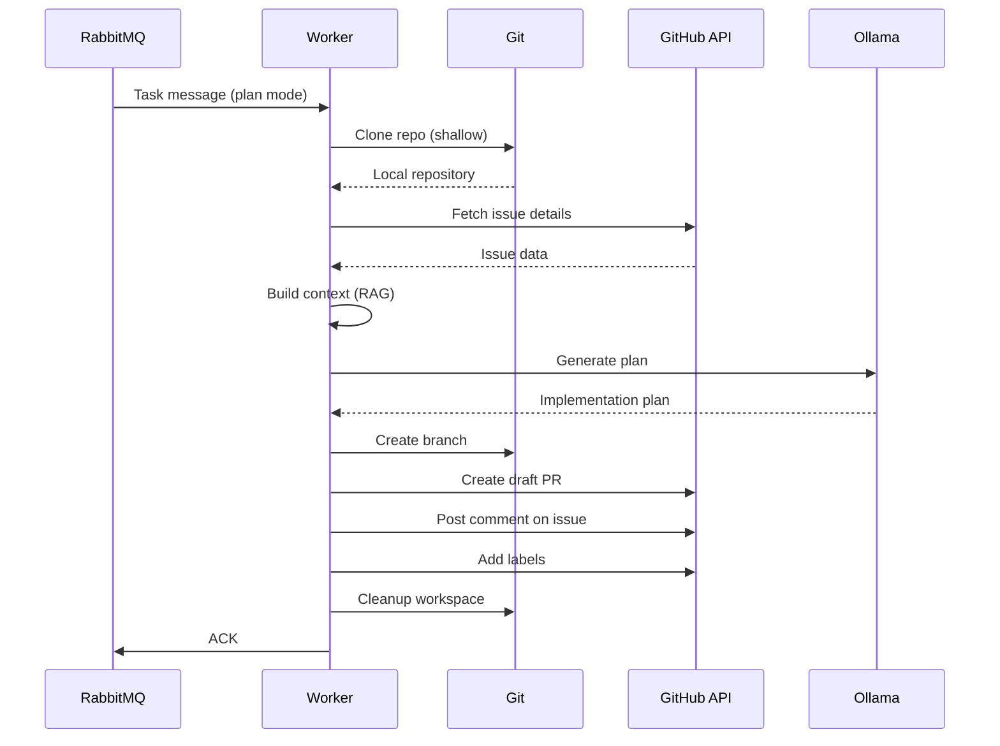

# Iteration 3: Git & LLM Integration - Technical Details

## Overview

Iteration 3 extends the worker with:
- Git operations (clone, branch, commit, push)
- GitHub API integration (issues, PRs, comments)
- Context building from repository and issue data
- LLM integration with Ollama
- Complete Plan Mode workflow

## Architecture



## Components

### 1. GitHandler (`worker/git_handler.py`)

Handles all Git operations:

**Methods:**
- `shallow_clone()` - Clone with depth=1
- `create_branch()` - Create new branch
- `commit_changes()` - Stage and commit
- `push_branch()` - Push to remote
- `cleanup()` - Remove workspace
- `get_file_tree()` - Generate file tree string

**Features:**
- Token injection for authentication
- Configurable clone depth
- Automatic cleanup
- Error handling with structured logs

### 2. GitHubClient (`worker/github_client.py`)

GitHub API operations using PyGithub:

**Methods:**
- `get_repository()` - Get repo from URL
- `get_issue()` - Fetch issue by ID
- `get_issue_data()` - Extract issue metadata
- `create_pull_request()` - Create PR (draft/ready)
- `add_issue_comment()` - Post comments
- `add_labels()` - Add labels to issues/PRs

**Features:**
- Automatic retry on API errors
- Structured logging
- Type-safe with PyGithub models

### 3. ContextBuilder (`worker/context_builder.py`)

Builds context for LLM prompts:

**Methods:**
- `build_issue_context()` - Format issue data
- `identify_relevant_files()` - Find files related to issue
- `read_file_contents()` - Read and truncate files
- `build_full_context()` - Assemble complete prompt

**File Relevance Algorithm:**
1. Extract keywords from issue title and body
2. Score files based on:
   - Filename matches (+5 points)
   - Path matches (+2 points)
   - Content matches (+1 point each)
3. Return top 10 highest-scored files

**Features:**
- Keyword-based relevance (simple RAG)
- File size limits (500 lines max)
- Ignores common directories (.git, node_modules, etc.)

### 4. LLMClient (`worker/llm_client.py`)

LLM API client for Ollama:

**Methods:**
- `generate_plan()` - Generate implementation plan
- `_call_ollama()` - HTTP call to Ollama API
- `_build_plan_prompt()` - Construct prompt

**Configuration:**
- Temperature: 0.2 (lower for deterministic code)
- Top-p: 0.9
- Timeout: 300 seconds (5 minutes)

**Features:**
- Async HTTP with httpx
- Configurable parameters
- Error handling and retries

### 5. PlanMode (`worker/modes/plan_mode.py`)

Orchestrates the complete Plan Mode workflow:

**Workflow:**
1. Clone repository
2. Fetch issue from GitHub
3. Generate file tree
4. Identify relevant files (top 10)
5. Read file contents
6. Build context
7. Call LLM to generate plan
8. Create branch
9. Create draft PR with plan
10. Post comment on issue
11. Add labels
12. Cleanup workspace
13. Close LLM client

**Error Handling:**
- Try/except at every external call
- Cleanup in finally block
- Graceful degradation
- Structured logging throughout

## Configuration

### Environment Variables

Added to `worker/config.py`:

```python
# GitHub
github_token: str = ""

# LLM
llm_provider: str = "ollama"
llm_model: str = "codellama"
ollama_base_url: str = "http://localhost:11434"
```

### Kubernetes ConfigMap

Added to `k8s/base/configmap.yaml`:

```yaml
LLM_PROVIDER: "ollama"
LLM_MODEL: "codellama"
OLLAMA_BASE_URL: "http://ollama.ai-agent.svc.cluster.local:11434"
```

### Secrets

New secret required: `github-credentials`

```bash
kubectl create secret generic github-credentials \
  --from-literal=token=ghp_xxxxx \
  -n ai-agent
```

## Dependencies

Added to `worker/requirements.txt`:

```
GitPython==3.1.40    # Git operations
PyGithub==2.1.1      # GitHub API
httpx==0.26.0        # Async HTTP for LLM
```

## Deployment Changes

### Worker Dockerfile

Added git installation:

```dockerfile
RUN apt-get install -y git
```

All Python modules copied:

```dockerfile
COPY *.py .
```

### Worker Deployment

Added environment variable:

```yaml
- name: GITHUB_TOKEN
  valueFrom:
    secretKeyRef:
      name: github-credentials
      key: token
```

### New K8s Resources

**Ollama Deployment** (`k8s/base/ollama-deployment.yaml`):
- Deployment: Ollama service
- Service: ClusterIP on port 11434
- Job: Pull codellama model on startup

## Testing

### Create Test Issue

1. Go to your GitHub repository
2. Create a new issue
3. Title: "Fix typo in README"
4. Body: "Please fix the typo on line 42"
5. Add label: `ai-help`

### Trigger Processing

```bash
python scripts/test-iteration3.py \
  --repo-url https://github.com/username/repo \
  --issue-id <issue-number>
```

### Expected Logs

```json
{"event": "task_received", "mode": "plan", ...}
{"event": "plan_mode_start", ...}
{"event": "cloning_repo", ...}
{"event": "clone_success", ...}
{"event": "issue_fetched", "title": "Fix typo...", ...}
{"event": "files_identified", "count": 5, ...}
{"event": "context_built", ...}
{"event": "generating_plan", ...}
{"event": "plan_generated", ...}
{"event": "branch_created", ...}
{"event": "pr_created", "pr_number": 123, ...}
{"event": "comment_added", ...}
{"event": "labels_added", ...}
{"event": "cleanup_done", ...}
{"event": "plan_mode_complete", ...}
```

### Expected GitHub Changes

1. **New branch**: `ai-agent/issue-{id}`
2. **Draft PR** with:
   - Title: `[AI Agent] Fix issue #X: ...`
   - Body: Plan generated by LLM
   - Status: Draft
3. **Issue comment**: Link to PR
4. **Labels**: `ai-agent`, `plan-pending`

## Limitations

1. **Simple file relevance** - Keyword-based, no embeddings
2. **Limited context** - Max 10 files, 500 lines each
3. **Single LLM call** - No iterative refinement
4. **No code execution** - Only generates plan, doesn't implement

These will be addressed in future iterations.

## Code Quality

- ✓ Type hints throughout
- ✓ Pydantic validation
- ✓ Async/await patterns
- ✓ Structured logging (JSON)
- ✓ Error handling
- ✓ Resource cleanup
- ✓ Configurable timeouts

## Files Created

```
worker/
  ├── git_handler.py        (250 lines)
  ├── github_client.py      (200 lines)
  ├── context_builder.py    (220 lines)
  ├── llm_client.py         (160 lines)
  └── modes/
      └── plan_mode.py      (170 lines)

k8s/base/
  └── ollama-deployment.yaml (86 lines)

k8s/secrets/
  └── github-token.yaml.template

scripts/
  └── test-iteration3.py    (130 lines)

Total: ~1200 lines of new code
```

## Summary

Iteration 3 transforms the Hello World worker into a functional AI coding assistant that can:

✅ Clone GitHub repositories  
✅ Analyze issues  
✅ Build context from code  
✅ Generate implementation plans with LLM  
✅ Create draft PRs  
✅ Interact with GitHub  
✅ Scale automatically with KEDA  

Next: Iteration 4 will add code execution and QuickFix mode.

